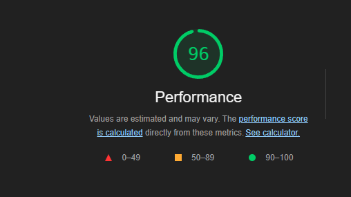
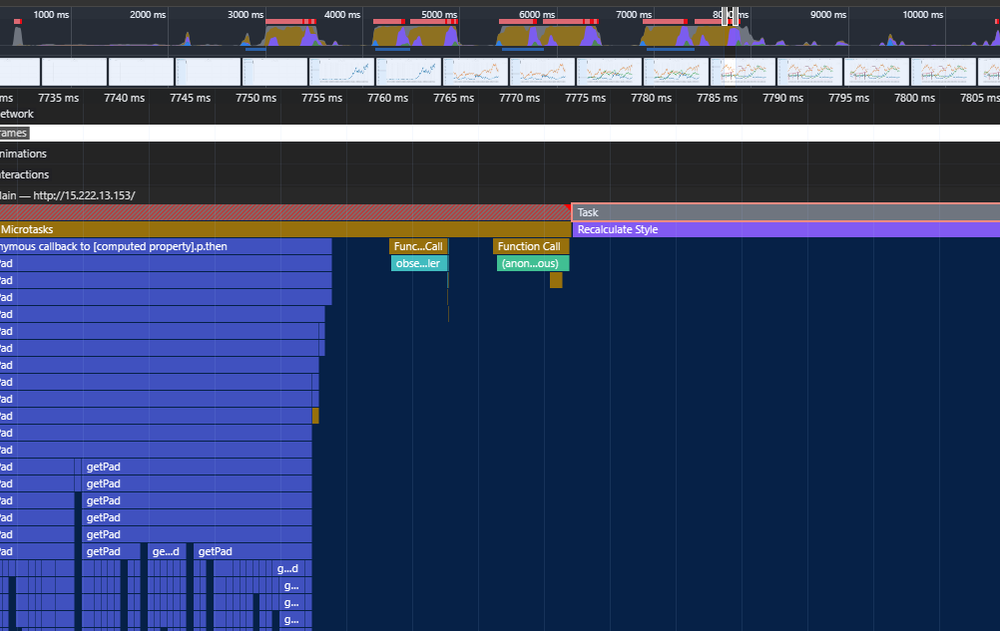
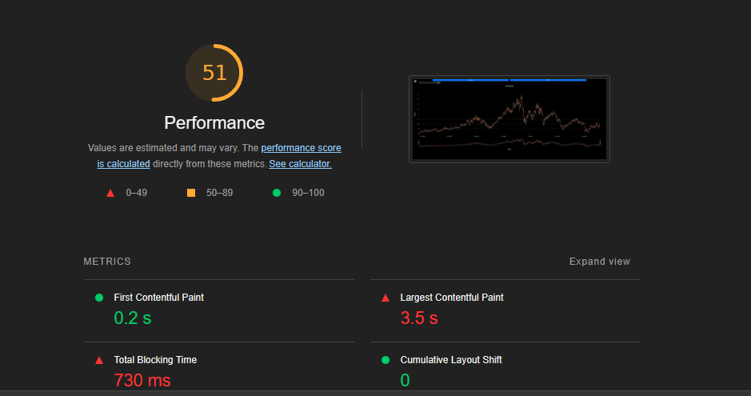
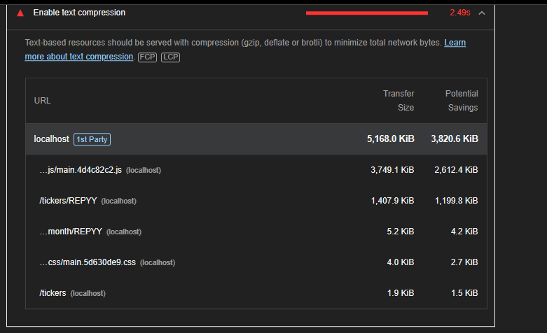
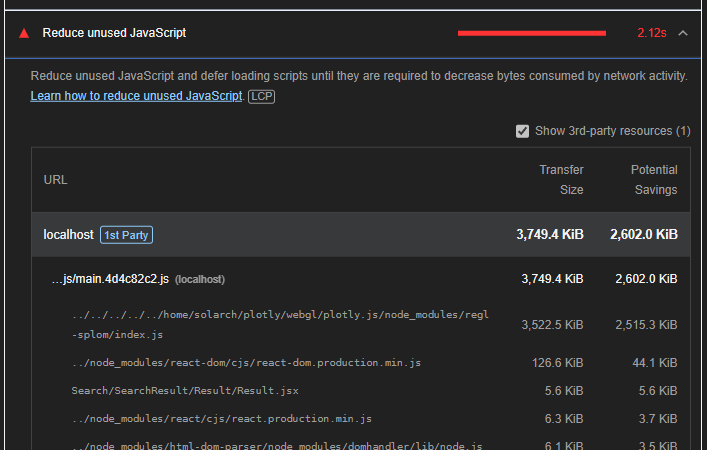
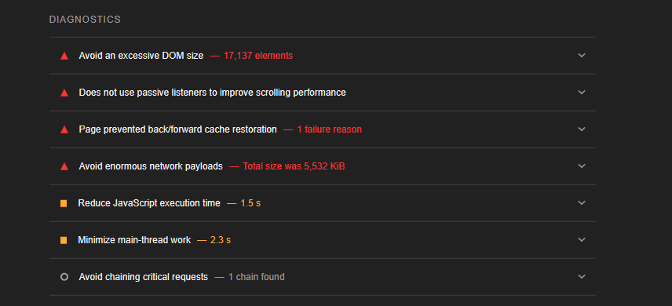
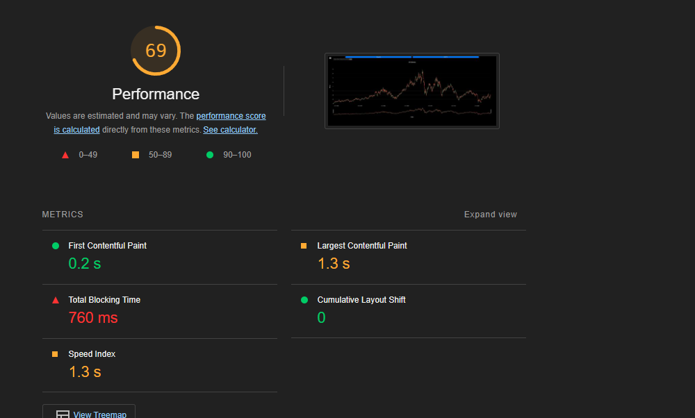

# Performance of <!-- Project Title -->

## Introduction and Methodology

In our project, we first looked at the plotly documentation to further improve our design and functionality of the website, as when we tested our app initially, we had a score of 96 without rendering any sort of graph.

Our goal is to test using the network panel and reduce as much overhead as possible when rendering the webpage and its data. We also want to increase the speed of the graph, in which the user will interact with.

## Baseline Performance

However, when looking at the routes and fetching the data through the network tab, there was a large amount of data being processed at a time, causing the site to be blocked in rendering path. This lead to large drops in performance when we added a graph.

To help leviate these issues, we decided it would be best to overhaul the entire user interface and look more at the documentation of plotly so we can utilize it to further our performance goals. This lead to us adding a initial graph for testing the app at startup and we noticed a low score in lighthouse.

This was caused by the following issues, which we looked at:

 - We would need to compress the data on the server side to lower the amount of data being stored and fetched.

- The result panel for the search of all the tickers was causing a large amount of javascript to be ran in the background. This caused the app to have issues running the range selection of the graph. To resolve this issue we would need to hide the window from opening whilst the user is interacting with the graph.

- This issue with the large amount of html elements was an issue common with the plotly discussions and even their examples on https://plotly.com/javascript/candlestick-charts/
  - We noticed that the score was at 68 for the performance side of the website and had issues with the large amount of html elements. Online it stated that there was no way around it since plotly was not built with an optimizing feature for their graphs. 
  - To solve the issue, it was recommend we switch over to another library for rendering the graph, one that supported better acceleration and not displaying all the tickers at once.

Our final score was achieved at a score of 69, a point higher than the plotly example page.

## Areas to Improve

- Functionality with fetching data
- Optimizing more children nodes of the graph to solve the biggest performance issue
- Improve the window scaling with mobile devices by adding an event listener (when the user rotates the screen)
- Hide unwanted data from interfering with the interaction of the user and the graph.

## Summary of Changes 

### Change 1 - Redesign UI
Lead: Christopher
- Improve the functionality of the website by reading the documentation of plotly and adding in functionality to optimize the rendering process as much as possible.
  - Solved, it boosted performance from 59 to 69
    - This was probably due to a ton of overhead of using a zoom function with the plotly and the entire dataset being plotted using string times instead of actual date times.

### Change 2 - Implement Follow Button
Lead: Oni
- Improves the search functionality, rather than rendering the entire list of the tickers, it would pull from an existing saved list from the cache.
  - Solved, it boosted performance from the initial time when loading the list of results. It increase the speed at which it tracks favourite tickers relative to the ones in the entire list
    - This was most likely due to rendering a smaller list, one that is stored locally by default and has less html elements as children.

### Change 3 - Hide the search bar when zooming into graph
Lead: Charles
- Improve the functionality of the interface with the graph by hiding the minimal nodes of html as possible. 
  - Unknown

### Change 4 - Add intervals for dates selection
Lead: Christopher
- Improve the aspect of day overviews by introducing buttons to select a range of dates
  - Solved, it increased the speed at which the graph was able to operate at. By having a shorter list of days to display, the app was much faster at the shorter rendered days.
    - This was likely due to having less children to render in the graph, removing overhead of unnessary nodes the user doesn't want to see.

### Change 5 - Fetch routes 30 days initially
Lead: Christopher
- Improve the fetching speed of the data by isssuing a 30 day month data first, whilst waiting for the final dataset to be shown.
  - Solved, increased the speed of rendering of the graph, will no longer lock up when there is a wait time for the fetched data to be displayed.
    - This is probably due to using a smaller resource to cache the data initially and serving as a placeholder for a much larger dataset to be shown after a few more seconds.

## Conclusion

Overall, the biggest improve to the app was a major redesign of the Chart.jsx, changing how it functioned and looked. When using the entire documentation it yielded a responsive webpage and results greater than even plotly's example of a minimally tracked graph. Our speeds increased drastically and the only big issue was with the amount of children presently rendered in the page, causing the app to slowdown a lot.

