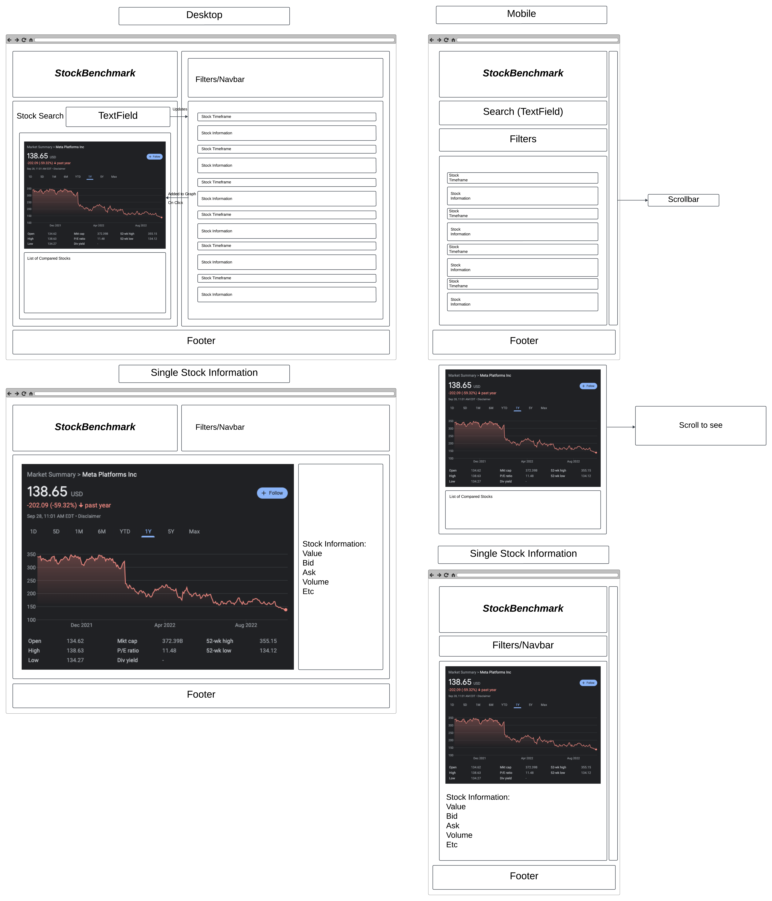

# StockBenchmark
## Data

## API
/api/v1/stocks (will get every single stock)
/api/v1/stocks/:name (will get stocks filtered by name)
/api/v1/tops/:position (will get stocks filtered by performance)

## Visualisations
We want the user to be able to compare stock prices over time (1 day, 1 week, 1 month, 1 year, all time) using graphs, users will also be able to display data about a single stock.

## Views
{width=80%}
On the desktop side, everything will be over the fold. While on the mobile side, the graph containing the compared stocks will be under the fold.
## Functionality
The user will be able to select one or multiple stocks, which will then be added to a single graph and compared. The user will also be able to click on stocks themselves to see more information about them and a graph containing only it's information.
The user will be able to filter stock prices depending on the categories they are looking for by clicking on a drop down window, they will also be able to search for specific stocks.

## Features and Priorities
Core features:
Multiple stock comparison, specific stock search.
Aspects that might be cut:
Filters, Single Stock Information. 

## Dependencies
react-plotly
(we wanted to draw graphs with our data, and this dependency lets us do that)
